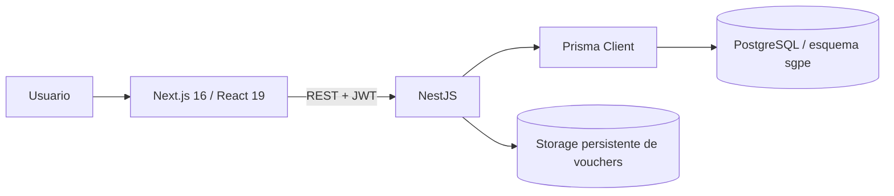

# Arquitectura

## Vista general

La solución es un repositorio con dos aplicaciones npm independientes. No existe infraestructura cloud, contenedores ni proxy reverso definidos en el código actual.

## Frontend

Next.js App Router ofrece `/login` y rutas protegidas bajo `/dashboard`. Los servicios de `frontend/src/services` encapsulan Axios; `NEXT_PUBLIC_API_URL` define la API.

El JWT, el usuario y la última actividad se guardan en `sessionStorage`. `SessionGuard` valida el perfil, aplica 30 minutos de inactividad, exige cambio de contraseña cuando corresponde y restringe Dirección a Reportes/Acerca del sistema. El interceptor distingue `401` (limpia sesión) de `403` (conserva sesión y redirige a una ruta permitida).

## Backend

NestJS expone una API REST con validación global (`whitelist`, rechazo de campos no permitidos y transformación). Módulos principales:

- `AuthModule`: login, perfil JWT y cambio de contraseña.
- `UsersModule`: perfiles, soporte público y administración de usuarios.
- `FamilyGroupsModule`: familias, integrantes e importación.
- `StudentsModule`: estudiantes.
- `EnrollmentsModule`: matrículas e importación.
- `SchoolPeriodsModule`: ciclo de vida de períodos.
- `AcademicStructureModule`: ciclos, niveles, turnos y aulas por período.
- `PaymentsModule`: pagos, conceptos y vouchers.
- `ReportsModule`: consultas y exportaciones XLSX/PDF.
- `DashboardModule`: resumen operativo.
- `PrismaModule`: acceso centralizado a persistencia.

## Persistencia

Prisma 6.16.2 mapea el esquema PostgreSQL `sgpe`. Las operaciones que combinan varias entidades críticas usan transacciones, y los flujos de períodos, pagos, matrículas, familias y usuarios registran auditoría según la operación.

Los vouchers tienen metadatos en PostgreSQL y contenido físico bajo `VOUCHER_STORAGE_PATH` o `backend/storage/vouchers`. La base y el filesystem deben respaldarse de forma coordinada.

## Autenticación y autorización

1. Login por username o por correo no ambiguo.
2. Contraseña verificada con bcrypt.
3. JWT Bearer con vigencia de 8 horas.
4. Cada request protegido vuelve a comprobar que usuario, persona y rol estén activos.
5. `RolesGuard` aplica los roles declarados en cada controlador y bloquea operaciones mientras exista cambio de contraseña pendiente.

La interfaz oculta navegación no permitida, pero el backend es la autoridad de seguridad.

## Responsabilidades

- **Frontend:** interacción, estado visual, navegación y consumo de API.
- **Controladores:** contrato HTTP, autenticación, roles y DTOs.
- **Servicios:** reglas, transacciones, auditoría y composición de respuestas.
- **Prisma/PostgreSQL:** relaciones, unicidad, integridad referencial e índices.
- **Storage:** conservación de evidencia documental asociada a pagos.

