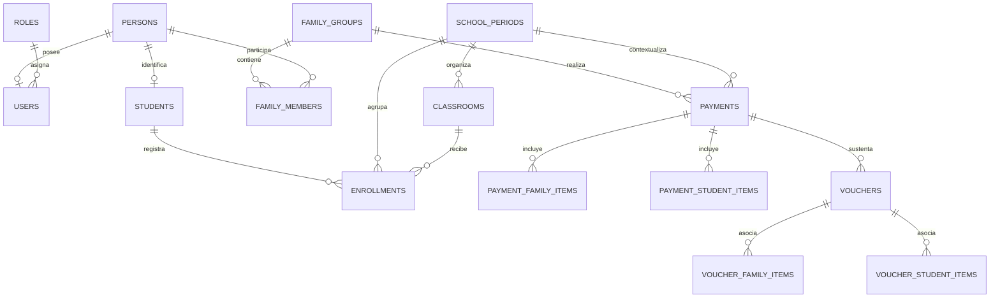

# Modelo de datos

La fuente vigente es `backend/prisma/schema.prisma`. PostgreSQL utiliza el esquema lógico `sgpe` y UUID generados con `gen_random_uuid()` como claves primarias.

## Entidades principales

| Área | Entidades |
| --- | --- |
| Seguridad | `users`, `roles`, `persons`, `audit_logs` |
| Familias | `family_groups`, `family_members`, `student_person_relationships` |
| Académica | `students`, `school_periods`, `education_cycles`, `education_levels`, `shifts`, `classrooms`, `enrollments` |
| Pagos | `payments`, `payment_family_items`, `payment_student_items`, `vouchers`, `voucher_family_items`, `voucher_student_items` |
| Secuencias | `document_sequences` |

## Relaciones simplificadas



## Integridad destacada

- Persona: documento único por `(document_type, document_number)`.
- Usuario: `username` y `person_id` únicos; una persona no puede respaldar dos cuentas.
- Período: `year` único.
- Aula: única por período, nivel, turno y nombre.
- Matrícula: un estudiante por período mediante `(student_id, school_period_id)`.
- Integrante familiar: una persona una sola vez por familia.
- APAFA: un item por familia y período.
- Taller: un item por estudiante y período.
- Los vínculos de voucher incluyen `payment_id` en sus claves foráneas compuestas para impedir asociaciones entre pagos distintos.

Los índices cubren búsquedas frecuentes por documento, período, familia, estudiante, usuario registrador, fecha de pago y entidades auditadas.

## Activación lógica

`is_active` existe en roles, personas, usuarios, estudiantes, familias, períodos, niveles y aulas. Es un control de vigencia usado por los servicios; no debe interpretarse como un mecanismo universal de soft delete. Las tablas históricas y transaccionales no tienen una columna de borrado lógico común.

## Pagos y vouchers

`payments` identifica la operación. `payment_family_items` representa APAFA y `payment_student_items` Taller. Cada voucher conserva nombre original, nombre físico, ruta, MIME, tamaño, hash y fecha de carga. Las tablas puente determinan exactamente qué conceptos sustenta cada archivo.

## Migraciones

Las migraciones versionadas están en `backend/prisma/migrations`:

1. baseline del esquema;
2. simplificación del modelo de pagos;
3. vínculos voucher–concepto;
4. gestión de cambio de contraseña.

Aplicación segura en entornos desplegados:

```bash
cd backend
npx --no-install prisma migrate deploy
```

No edite migraciones ya aplicadas. Respalde la base antes de desplegar cambios estructurales.
